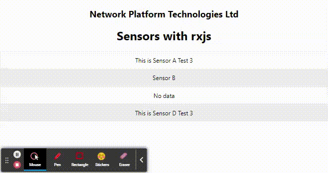

# sensors-rxjs

#### REQUIREMENTS:
- view object contains latest value of each sensor A, B, C, D
- View object must not be rendered more often than every 200ms
- View object must only be rendered when one of the systems sends a new value
- If a specific sensor is not sending data for 1300ms, its value (in the view object) should be ‘no data’
- All 4 sensors must emit at least one value before the first “view object” is ever displayed on the dashboard.

#### DELIVERABLES:
- provide a basic UI in react
- you MUST use RXJS
- provide unit tests and basic component tests

